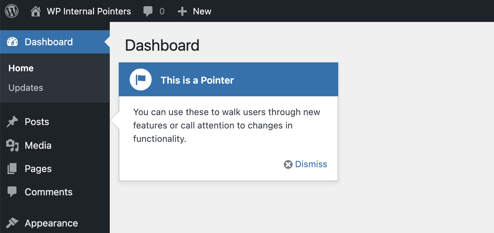

# WP Internal Pointers

Pointers have exsited in WordPress since version 3.3.0, but there is not much documentation explaining how to use them.



> [!NOTE]
> Pointers aren't used to introduce new features anymore, so it could be removed in future versions of WordPress. At the time of this reasearch, the functionality exists in WordPress 6.4.2 and is generally included for backwards compatibility.*

At it's core, it's a class that includes the JS required to display nice looking tool tips "pointing" at certain elements in the WordPress admin. Unfortunately, the class is marked `final` which prevents plugin authors from extending it and making proper use of it.

If you want to include them in your plugin, you have to include the pointer dependencies manually.

## Plugin Implementation

Enqueue a javascript file depending on `jquery`, and `wp-pointer`
```php
wp_enqueue_script( 'prefix-pointer',  plugins_url( 'wp-internal-pointers' ) . '/js/pointer.js', ['jquery', 'wp-pointer'] );
```
Set up the pointer that you need to display to the user
```js
jQuery(document).ready( function($) {
    let pointerId = 1;

    let pointer = $('#menu-posts').pointer({
        content: '<h3>This is a Pointer</h3><p>You can use these to walk users through new features or call attention to changes in functionality.</p>',
        position: {
               edge: 'left',
               align: 'center'
           },
        close: function() {
            $.post( ajaxurl, {
             pointer: 'prefix-pointer-' + pointerId,
             action: 'dismiss-wp-pointer'
            })
        }
    }).pointer('open');

    // Update the pointer element to have a unique id for dismissing.
    pointer.pointer('widget').attr('id', 'prefix-pointer-' + pointerId);
});
```

When you have implemented these, the pointer should display on the "Posts" menu item on the left side of your admin.

Clicking "dismiss" will trigger the `close` method and fire off the ajax action that stores the dismissed pointers to the current user's meta.

You'll also want to check that the current user has that dismissed pointer in their meta (`wp_dismissed_pointers`) with:
```php
// Gather the list of dismissed pointer IDs in an array of strings.
$dismissed = array_filter( explode( ',', (string) get_user_meta( get_current_user_id(), 'dismissed_wp_pointers', true ) ) );

// Your pointers that should not be shown.
if ( in_array( 'tar-pointer-1', $dismissed ) ) {
    // Don't show the pointer.
    return;
}
```
